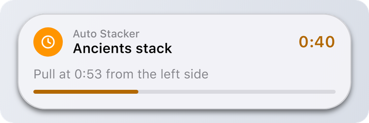

# Overview

Dynamic Island is an Umbrella script that turns the top of the Dota 2 screen into an iPhone style island: music, alerts, timers, fights. The SDK lets **any other script** use it. You pass a title, an icon and a color, the island draws the rest, so every script looks like it belongs to the same system.

<figure><picture><source srcset=".gitbook/assets/notify-dark.png" media="(prefers-color-scheme: dark)"></picture></figure>

## What you can do

* **Notifications.** A banner with your script's name, a title, a longer text and up to two buttons. Passive ones go straight to the notification center.
* **Live activities.** Things that last: a timer, a progress bar, a counter. They sit in the island and expand on hover.
* **Sounds.** Play the island's own UI sounds through the user's sound settings.

<figure><picture><source srcset=".gitbook/assets/activity-expanded-dark.png" media="(prefers-color-scheme: dark)"></picture></figure>

## 30 second example

```lua
local di = DynamicIsland
if type(di) == "table" and di.api then
    di.Notify({ app = "My Script", title = "Hello from my script", icon = "bell", tint = "blue" })
end
```

That is the whole integration. The first time your script sends something, the island asks the user if it's allowed, the same way an iPhone asks for an app.

## Where to go next


[quick-start.md](getting-started/quick-start.md)



[notify.md](reference/notify.md)



[activity.md](reference/activity.md)



The SDK only works when the user has Dynamic Island installed and turned on. Your script should keep working without it, see [Quick Start](getting-started/quick-start.md).

