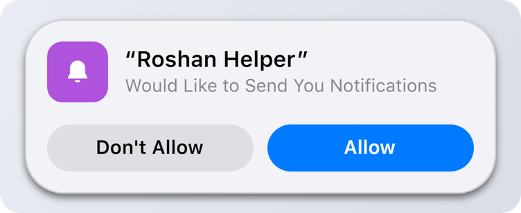

# Permissions

## The prompt

The first time your script sends a notification or starts an activity, the island asks the user:

<figure><picture><source srcset="../.gitbook/assets/permission-dark.png" media="(prefers-color-scheme: dark)"></picture></figure>

* In the main menu the prompt stays until the user answers.
* In a game it only shows outside of fights and hides after 12 seconds. It comes back in the main menu.

While the user hasn't answered, up to 3 of your notifications wait and are shown right after "Allow". Your activities wait too and appear as soon as the script is allowed.

## After the answer

| Answer | What your script sees |
| --- | --- |
| Allow | Everything works. `DynamicIsland.IsAllowed(app)` returns `true`. |
| Don't Allow | `Notify` and `Activity.Start` return `nil, "not allowed"`. Running activities end with the reason `"denied"`. |

The answer is saved, so the prompt is shown once per script name.

## Changing it later

The user can change the answer at any time in the Umbrella menu:

* **General > Dynamic Island > Alerts > Scripts:** a switch for every script that has asked.
* The gear next to each switch has **Allow in Focus**. With it on, your notifications get through Focus mode.
* **Enable Island > More > Reset Script Permissions** forgets every answer, so each script asks again.


Checking `DynamicIsland.IsAllowed(app)` is optional. Just call `Notify`: if the user hasn't answered yet, the island asks and holds your notification.

