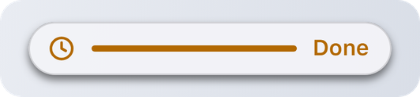

# ActivityHandle

Returned by [`Activity.Start`](activity.md). Both `act:Update{}` and `act.Update{}` work.

## id

`act.id:` **`integer`**

Unique id of this activity.

## Update

`act:Update(fields):` **`boolean`**

| Name | Type | Description |
| --- | --- | --- |
| **fields** | **`table`** | Any of the [Activity.Start options](activity.md#options) except `app`. |

Changes the activity. Only the fields you pass change. Returns `false` once the activity has ended.

* `false` or `""` clears a text field: `act:Update({ subtitle = false })`.
* `progress = false` hides the bar, `timer = false` stops the timer.
* Setting `trailing` stops the timer, so you can switch from a countdown to a text.

<details>

<summary>Example</summary>

```lua
local left = stackAt - GameRules.GetGameTime()
act:Update({ progress = 1 - left / 60 })
```

</details>

## End

`act:End([fields]):` **`nil`**

| Name | Type | Description |
| --- | --- | --- |
| **fields `[?]`** | **`table`** | Final content, plus `after`. |

Ends the activity. With `after`, the island keeps your final content on screen for that many seconds first, up to 10.

<figure><picture><source srcset="../.gitbook/assets/activity-final-dark.png" media="(prefers-color-scheme: dark)"></picture></figure>

<details>

<summary>Example</summary>

```lua
act:End({ title = "Stacked", trailing = "Done", progress = 1, after = 3 })
```

</details>

## IsActive

`act:IsActive():` **`boolean`**

`false` as soon as you call `End` or the island ends the activity.

<details>

<summary>Example</summary>

```lua
local function OnFrame()
    if act and act:IsActive() then
        act:Update({ progress = GetProgress() })
    end
end
```

</details>
