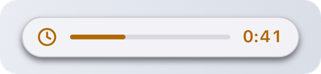
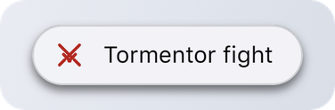

# Activity

## Activity.Start

`DynamicIsland.Activity.Start(options):` [**`ActivityHandle`**](activity-handle.md) | **`nil`**, **`string`**

| Name | Type | Description |
| --- | --- | --- |
| **options** | **`table`** | Fields below. |

Starts a live activity and returns a handle to update or end it. Returns `nil` and a [reason](types.md#error-reasons) when it can't start.

<figure><picture><source srcset="../.gitbook/assets/activity-compact-dark.png" media="(prefers-color-scheme: dark)"></picture></figure>

### Options

Only `app` is required.

| Name | Type | Description |
| --- | --- | --- |
| **app** | **`string`** | Your script's name, same as in [Notify](notify.md). |
| **title `[?]`** | **`string`** | Title, up to 60 characters. |
| **subtitle `[?]`** | **`string`** | Second line in the expanded view, up to 80 characters. |
| **trailing `[?]`** | **`string`** | Short text on the right, up to 12 characters, like `"3/5"` or `"45%"`. |
| **timer `[?]`** | **`number`** | Seconds to count down. The island counts on its own. |
| **progress `[?]`** | **`number`** | 0 to 1. Draws a progress bar. |
| **icon `[?]`** | [**`Icon`**](types.md#icons) | Glyph or image path. `(default: "bell")` |
| **tint `[?]`** | [**`Tint`**](types.md#tints) | Color of the icon, timer and bar. |
| **onTap `[?]`** | **`function`** | Called when the user clicks the expanded activity or its side bubble. |
| **onEnd `[?]`** | **`function(reason)`** | Called when **the island** ends your activity, with an [end reason](types.md#end-reasons). Not called when you end it yourself. |
| **staleAfter `[?]`** | **`number`** | Seconds without an `Update` after which the island ends the activity, 5 or more. |

<details>

<summary>Example</summary>

```lua
local act = DynamicIsland.Activity.Start({
    app = "Auto Stacker",
    icon = "clock",
    tint = "orange",
    title = "Ancients stack",
    subtitle = "Pull at 0:53 from the left side",
    timer = 42,
    progress = 0,
    onEnd = function(reason) Log.Write("island ended it: " .. reason) end
})
```

</details>

## How it looks

**Compact.** The icon on the left, then a progress bar if you set `progress`, then the timer or `trailing` on the right. With neither, the title is shown.

Timer and progress:

<figure><picture><source srcset="../.gitbook/assets/activity-compact-dark.png" media="(prefers-color-scheme: dark)"></picture></figure>

Trailing text:

<figure><picture><source srcset="../.gitbook/assets/activity-trailing-dark.png" media="(prefers-color-scheme: dark)"></picture></figure>

Title only:

<figure><picture><source srcset="../.gitbook/assets/activity-title-dark.png" media="(prefers-color-scheme: dark)"></picture></figure>

**Expanded.** Hovering the island shows your script's name, the title, the subtitle and the bar.

<figure><picture><source srcset="../.gitbook/assets/activity-expanded-dark.png" media="(prefers-color-scheme: dark)"></picture></figure>

## Sharing the island

The island has one main spot and one side bubble. Who gets which:

| Situation | Island | Side bubble |
| --- | --- | --- |
| Your activity and music | your activity | music, with controls on hover |
| Activities from two scripts | the newest one | the other one, with a progress ring |
| A fight | the fight | your activity |
| A notification comes in | the notification | your activity comes back after it |

<figure><picture><source srcset="../.gitbook/assets/activity-music-dark.png" media="(prefers-color-scheme: dark)"></picture></figure>

<figure><picture><source srcset="../.gitbook/assets/activity-two-dark.png" media="(prefers-color-scheme: dark)"></picture></figure>

## Rules

* One activity per script. Starting a new one ends your previous one.
* 3 activities at most across all scripts.
* The user can swipe your activity away sideways, then `onEnd("dismissed")` is called.
* An activity ends by itself after 4 hours.
