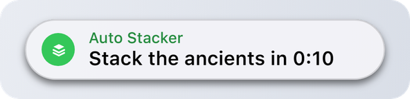
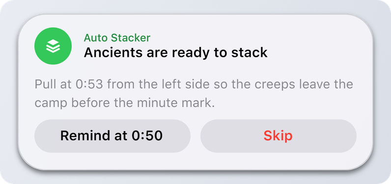
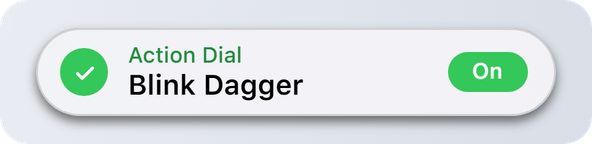
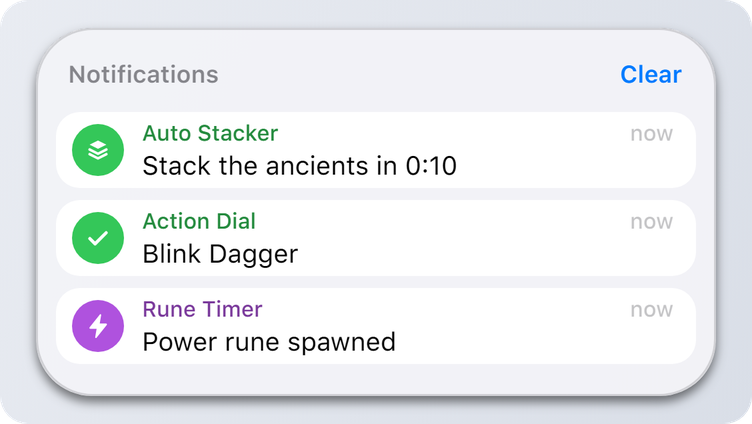

# Notify

## Notify

`DynamicIsland.Notify(options):` **`integer`** | **`nil`**, **`string`**

| Name | Type | Description |
| --- | --- | --- |
| **options** | **`table`** | Fields below. |

Shows a notification. Returns its id, or `nil` and a [reason](types.md#error-reasons). Before the island has finished loading, it returns `0` and shows the notification a moment later.

<figure><picture><source srcset="../.gitbook/assets/notify-dark.png" media="(prefers-color-scheme: dark)"></picture></figure>

### Options

Only `app` and `title` are required.

| Name | Type | Description |
| --- | --- | --- |
| **app** | **`string`** | Your script's name, up to 24 characters. Shown above the title, groups your notifications in the notification center, and it's what the user allows or denies. |
| **title** | **`string`** | Main line, up to 80 characters. |
| **body `[?]`** | **`string`** | Longer text, up to 160 characters. Shown when the notification expands. |
| **icon `[?]`** | [**`Icon`**](types.md#icons) | An island glyph or a path to an image. `(default: "bell")` |
| **tint `[?]`** | [**`Tint`**](types.md#tints) | Color of the icon circle and the app name. Without it your script gets its own color. |
| **level `[?]`** | [**`Level`**](types.md#levels) | How loud the notification is. `(default: "active")` |
| **sound `[?]`** | [**`Sound`**](types.md#sounds) \| **`false`** | Sound to play, `false` for none. |
| **trailing `[?]`** | **`string`** | A short pill on the right, up to 12 characters. |
| **duration `[?]`** | **`number`** | Seconds on screen, 1.5 to 8. Without it the user's own setting is used. |
| **onTap `[?]`** | **`function`** | Called when the user clicks the notification, in the island or in the notification center. |
| **actions `[?]`** | **`table[]`** | Up to 2 buttons, see below. |

<details>

<summary>Example</summary>

```lua
DynamicIsland.Notify({
    app = "Auto Stacker",
    title = "Stack the ancients in 0:10",
    icon = "stack",
    tint = "green",
    onTap = function() Log.Write("tapped") end
})
```

</details>

## Expanded notification

When a notification has a `body` or `actions`, hovering it expands the island. While it's expanded, the timer pauses.

<figure><picture><source srcset="../.gitbook/assets/notify-expanded-dark.png" media="(prefers-color-scheme: dark)"></picture></figure>

### Action

| Name | Type | Description |
| --- | --- | --- |
| **title** | **`string`** | Button text, up to 20 characters. |
| **fn `[?]`** | **`function`** | Called on click. The notification closes after it. |
| **destructive `[?]`** | **`boolean`** | Red text, for actions like "Skip" or "Delete". |

<details>

<summary>Example</summary>

```lua
DynamicIsland.Notify({
    app = "Auto Stacker",
    title = "Ancients are ready to stack",
    body = "Pull at 0:53 from the left side so the creeps leave the camp before the minute mark.",
    icon = "stack",
    tint = "green",
    actions = {
        { title = "Remind at 0:50", fn = RemindLater },
        { title = "Skip", destructive = true, fn = SkipStack }
    }
})
```

</details>

## Trailing pill

A short status on the right. Good for toggles.

<figure><picture><source srcset="../.gitbook/assets/notify-trailing-dark.png" media="(prefers-color-scheme: dark)"></picture></figure>

<details>

<summary>Example</summary>

```lua
local on = not blinkEnabled
DynamicIsland.Notify({
    app = "Action Dial",
    title = "Blink Dagger",
    icon = on and "check" or "close",
    tint = on and "green" or "red",
    trailing = on and "On" or "Off",
    duration = 2.5
})
```

</details>

## Notification center

Every notification also lands in the island's notification center, grouped by `app`. Passive ones go only there. Clicking a single notification in the center calls its `onTap`.

<figure><picture><source srcset="../.gitbook/assets/notification-center-dark.png" media="(prefers-color-scheme: dark)"></picture></figure>

## Good to know

* A new notification from the same `app` replaces the one on screen instead of waiting in line. Toggles feel instant.
* `time-sensitive` notifications jump the queue and get through Focus when the user allows urgent alerts.
* The island copies what it needs from your table, so changing the table after the call does nothing.
* There are limits on how often a script can send, see [Limits and Safety](../guides/limits-and-safety.md).


`Notify("My Script", "Title", icon, duration)` with plain arguments also works, but the table form is the one to use.

