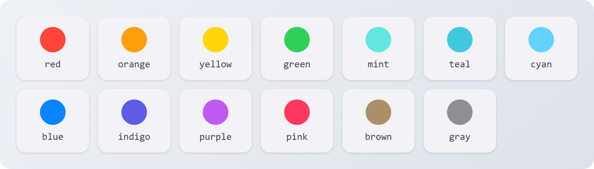

# Types

## Icons

`Icon:` **`string`**

Either the name of one of the island's glyphs, or a path to an image.

**Glyphs.** These look best as monochrome icons in notifications and activities:

<figure><picture><source srcset="../.gitbook/assets/glyphs-dark.png" media="(prefers-color-scheme: dark)"></picture></figure>

`DynamicIsland.Glyphs()` lists every glyph, including the colored rune and tower icons.

**Images.** A relative path inside the game or cheat folder, for example `panorama/images/items/blink_png.vtex_c`. Up to 160 characters, no `..`, no absolute paths. All scripts together can use up to 32 different images per session. If the image fails to load, the island shows a bell.

## Tints

`Tint:` **`string`** | **`Color`**

* A system color name:

<figure><picture><source srcset="../.gitbook/assets/tints-dark.png" media="(prefers-color-scheme: dark)"></picture></figure>

* A hex string: `"FF9F0A"` or `"#FF9F0A"`.
* A `Color(r, g, b)`.

Without a tint, every script gets its own stable color from its name. On the light island, text in your tint is darkened a little so it stays readable.

## Levels

`Level:` **`string`**

| Value | What happens |
| --- | --- |
| `"passive"` | No banner and no sound, straight to the notification center. |
| `"active"` | The normal banner. `(default)` |
| `"time-sensitive"` | Jumps ahead of other notifications, plays a chime, and gets through Focus when the user allows urgent alerts. |

## Sounds

`Sound:` **`string`**

For `Notify`: `"default"`, `"chime"`, `"success"`, `"failure"`.

For `PlaySound`, all of the above plus the island's own sounds: `notification_toast`, `timer_chime`, `courier_delivered`, `courier_death_or_fail`, `button_press`, `button_dismiss`, `wheel_notch`, `wheel_boundary_bump`, `island_expand`, `island_collapse`, `island_hover`, `toast_dismiss`.

## End reasons

Passed to `onEnd` when the island ends your activity.

| Reason | When |
| --- | --- |
| `"dismissed"` | The user swiped it away. |
| `"denied"` | The user turned your script off. |
| `"muted"` | Your script was muted for sending too much. |
| `"stale"` | No `Update` for longer than `staleAfter`. |
| `"expired"` | It ran for 4 hours. |

## Error reasons

The second value `Notify` and `Activity.Start` return when they don't go through.

| Reason | Meaning |
| --- | --- |
| `"Notify expects a table"` | You passed something that isn't a table. |
| `"Activity.Start expects a table"` | Same for activities. |
| `"app required"` | No `app`, or it's empty. |
| `"title required"` | No `title` for a notification. |
| `"bad arguments"` | Something in the table threw an error while the island read it. |
| `"not allowed"` | The user said no to your script. |
| `"muted"` | Your script is muted until the next reload. |
| `"rate limited"` | Too many notifications too fast. |
| `"busy"` | Too many notifications or permission prompts are already waiting. |
| `"too many apps"` | More than 24 different app names were used this session. |
| `"too many activities"` | 3 activities are already running. |
