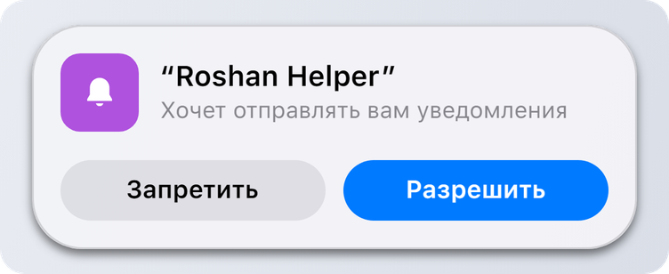

# Разрешения

## Запрос

Когда твой скрипт в первый раз отправляет уведомление или запускает активность, островок спрашивает пользователя:

<figure><picture><source srcset="../.gitbook/assets/permission-dark.png" media="(prefers-color-scheme: dark)"></picture></figure>

* В главном меню запрос висит, пока пользователь не ответит.
* В игре он показывается только вне драки и прячется через 12 секунд. Потом появится снова в главном меню.

Пока пользователь не ответил, до 3 твоих уведомлений ждут и покажутся сразу после «Разрешить». Активности тоже ждут и появятся, как только скрипт разрешат.

## После ответа

| Ответ | Что видит скрипт |
| --- | --- |
| Разрешить | Всё работает. `DynamicIsland.IsAllowed(app)` возвращает `true`. |
| Запретить | `Notify` и `Activity.Start` возвращают `nil, "not allowed"`. Запущенные активности заканчиваются с причиной `"denied"`. |

Ответ сохраняется, поэтому запрос показывается один раз на каждое название скрипта.

## Как поменять потом

Пользователь может поменять ответ в любой момент в меню Umbrella:

* **General > Dynamic Island > Оповещения > Скрипты:** переключатель для каждого скрипта, который просил доступ.
* В шестерёнке рядом с переключателем есть **Разрешить в фокусе**, чтобы уведомления скрипта проходили в режиме фокуса, и **Звук**, который выключает звуки только твоего скрипта, а баннеры продолжают приходить.
* **Включить Island > Ещё > Сбросить разрешения скриптов** забывает все ответы, и каждый скрипт спросит заново.


Проверять `DynamicIsland.IsAllowed(app)` не обязательно. Просто вызывай `Notify`: если пользователь ещё не ответил, островок спросит и придержит уведомление.

