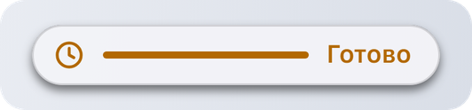

# ActivityHandle

Его возвращает [`Activity.Start`](activity.md). Работают оба варианта: `act:Update{}` и `act.Update{}`.

## id

`act.id:` **`integer`**

Уникальный id этой активности.

## Update

`act:Update(fields):` **`boolean`**

| Имя | Тип | Описание |
| --- | --- | --- |
| **fields** | **`table`** | Любые [поля Activity.Start](activity.md), кроме `app`. |

Меняет активность. Меняются только переданные поля. Возвращает `false`, если активность уже закончилась.

* `false` или `""` очищает текстовое поле: `act:Update({ subtitle = false })`.
* `progress = false` прячет полосу, `timer = false` останавливает таймер.
* Если задать `trailing`, таймер останавливается, так можно переключиться с отсчёта на текст.

<details>

<summary>Пример</summary>

```lua
local left = stackAt - GameRules.GetGameTime()
act:Update({ progress = 1 - left / 60 })
```

</details>

## End

`act:End([fields]):` **`nil`**

| Имя | Тип | Описание |
| --- | --- | --- |
| **fields `[?]`** | **`table`** | Финальное содержимое и `after`. |

Заканчивает активность. С `after` островок сначала держит финальное содержимое столько секунд, до 10.

<figure><picture><source srcset="../.gitbook/assets/activity-final-dark.png" media="(prefers-color-scheme: dark)"></picture></figure>

<details>

<summary>Пример</summary>

```lua
act:End({ title = "Застакано", trailing = "Готово", progress = 1, after = 3 })
```

</details>

## IsActive

`act:IsActive():` **`boolean`**

`false` сразу после вызова `End` или когда активность закончил островок.

<details>

<summary>Пример</summary>

```lua
local function OnFrame()
    if act and act:IsActive() then
        act:Update({ progress = GetProgress() })
    end
end
```

</details>
