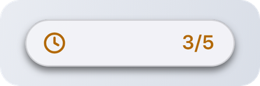
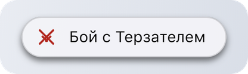
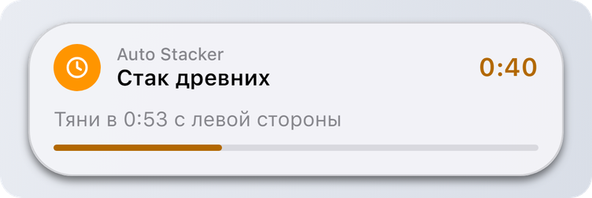
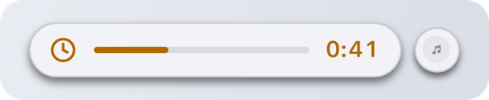
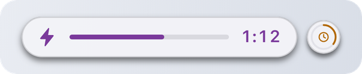

# Activity

## Activity.Start

`DynamicIsland.Activity.Start(options):` [**`ActivityHandle`**](activity-handle.md) | **`nil`**, **`string`**

| Имя | Тип | Описание |
| --- | --- | --- |
| **options** | **`table`** | Поля ниже. |

Запускает живую активность и возвращает объект, через который её можно обновить или закончить. Если запустить не вышло, возвращает `nil` и [причину](types.md).

<figure><picture><source srcset="../.gitbook/assets/activity-compact-dark.png" media="(prefers-color-scheme: dark)"></picture></figure>

### Поля

Обязателен только `app`.

| Имя | Тип | Описание |
| --- | --- | --- |
| **app** | **`string`** | Название твоего скрипта, как в [Notify](notify.md). |
| **title `[?]`** | **`string`** | Заголовок, до 60 символов. |
| **subtitle `[?]`** | **`string`** | Вторая строка в раскрытом виде, до 80 символов. |
| **trailing `[?]`** | **`string`** | Короткий текст справа, до 12 символов, например `"3/5"` или `"45%"`. |
| **timer `[?]`** | **`number`** | Сколько секунд отсчитывать. Островок считает сам. |
| **progress `[?]`** | **`number`** | От 0 до 1. Рисует полосу прогресса. |
| **icon `[?]`** | [**`Icon`**](types.md) | Глиф или путь к картинке. `(по умолчанию: "bell")` |
| **tint `[?]`** | [**`Tint`**](types.md) | Цвет иконки, таймера и полосы. |
| **onTap `[?]`** | **`function`** | Вызывается, когда пользователь нажал на раскрытую активность или на её боковой пузырь. |
| **onEnd `[?]`** | **`function(reason)`** | Вызывается, когда **островок** закончил твою активность, с [причиной](types.md). Когда заканчиваешь сам, не вызывается. |
| **staleAfter `[?]`** | **`number`** | Через сколько секунд без `Update` островок закончит активность, от 5. |

<details>

<summary>Пример</summary>

```lua
local act = DynamicIsland.Activity.Start({
    app = "Auto Stacker",
    icon = "clock",
    tint = "orange",
    title = "Стак древних",
    subtitle = "Тяни в 0:53 с левой стороны",
    timer = 42,
    progress = 0,
    onEnd = function(reason) Log.Write("островок закончил: " .. reason) end
})
```

</details>

## Как выглядит

**Компактно.** Иконка слева, дальше полоса прогресса, если задан `progress`, справа таймер или `trailing`. Если нет ни того, ни другого, показывается заголовок.

Таймер и прогресс:

<figure><picture><source srcset="../.gitbook/assets/activity-compact-dark.png" media="(prefers-color-scheme: dark)"></picture></figure>

Текст справа:

<figure><picture><source srcset="../.gitbook/assets/activity-trailing-dark.png" media="(prefers-color-scheme: dark)"></picture></figure>

Только заголовок:

<figure><picture><source srcset="../.gitbook/assets/activity-title-dark.png" media="(prefers-color-scheme: dark)"></picture></figure>

**Раскрыто.** При наведении видно название скрипта, заголовок, подзаголовок и полосу.

<figure><picture><source srcset="../.gitbook/assets/activity-expanded-dark.png" media="(prefers-color-scheme: dark)"></picture></figure>

## Кто где показывается

У островка одно главное место и один боковой пузырь:

| Ситуация | Островок | Боковой пузырь |
| --- | --- | --- |
| Твоя активность и музыка | твоя активность | музыка, при наведении с кнопками |
| Активности от двух скриптов | самая новая | другая, с кольцом прогресса |
| Драка | драка | твоя активность |
| Пришло уведомление | уведомление | твоя активность вернётся после него |

<figure><picture><source srcset="../.gitbook/assets/activity-music-dark.png" media="(prefers-color-scheme: dark)"></picture></figure>

<figure><picture><source srcset="../.gitbook/assets/activity-two-dark.png" media="(prefers-color-scheme: dark)"></picture></figure>

## Правила

* Одна активность на скрипт. Новая заканчивает предыдущую.
* Не больше 3 активностей от всех скриптов вместе.
* Пользователь может смахнуть активность вбок, тогда вызывается `onEnd("dismissed")`.
* Через 4 часа активность заканчивается сама.
