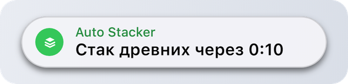
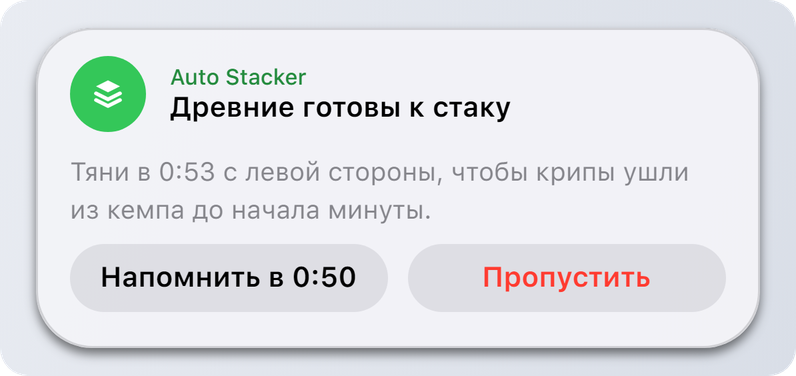
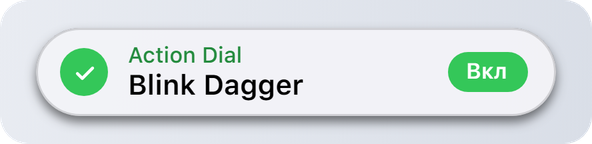
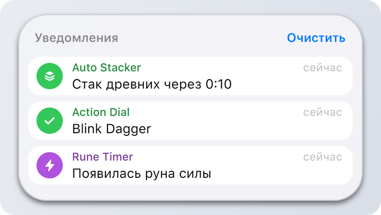

# Notify

## Notify

`DynamicIsland.Notify(options):` **`integer`** | **`nil`**, **`string`**

| Имя | Тип | Описание |
| --- | --- | --- |
| **options** | **`table`** | Поля ниже. |

Показывает уведомление. Возвращает его id или `nil` и [причину](types.md). Пока островок не догрузился, возвращает `0` и покажет уведомление чуть позже.

<figure><picture><source srcset="../.gitbook/assets/notify-dark.png" media="(prefers-color-scheme: dark)"></picture></figure>

### Поля

Обязательны только `app` и `title`.

| Имя | Тип | Описание |
| --- | --- | --- |
| **app** | **`string`** | Название твоего скрипта, до 24 символов. Показывается над заголовком, группирует уведомления в центре уведомлений, и именно его пользователь разрешает или запрещает. |
| **title** | **`string`** | Главная строка, до 80 символов. |
| **body `[?]`** | **`string`** | Длинный текст, до 160 символов. Виден, когда уведомление раскрыто. |
| **icon `[?]`** | [**`Icon`**](types.md) | Глиф островка или путь к картинке. `(по умолчанию: "bell")` |
| **tint `[?]`** | [**`Tint`**](types.md) | Цвет кружка иконки и названия. Без него у скрипта будет свой цвет. |
| **level `[?]`** | [**`Level`**](types.md) | Насколько громкое уведомление. `(по умолчанию: "active")` |
| **sound `[?]`** | [**`Sound`**](types.md) \| **`false`** | Звук, `false` без звука. |
| **trailing `[?]`** | **`string`** | Короткая плашка справа, до 12 символов. |
| **duration `[?]`** | **`number`** | Сколько секунд показывать, от 1.5 до 8. Без него берётся настройка пользователя. |
| **onTap `[?]`** | **`function`** | Вызывается, когда пользователь нажал на уведомление, в островке или в центре уведомлений. |
| **actions `[?]`** | **`table[]`** | До 2 кнопок, смотри ниже. |

<details>

<summary>Пример</summary>

```lua
DynamicIsland.Notify({
    app = "Auto Stacker",
    title = "Стак древних через 0:10",
    icon = "stack",
    tint = "green",
    onTap = function() Log.Write("нажали") end
})
```

</details>

## Раскрытое уведомление

Если у уведомления есть `body` или `actions`, при наведении островок раскрывается. Пока оно раскрыто, таймер стоит на паузе.

<figure><picture><source srcset="../.gitbook/assets/notify-expanded-dark.png" media="(prefers-color-scheme: dark)"></picture></figure>

### Кнопка

| Имя | Тип | Описание |
| --- | --- | --- |
| **title** | **`string`** | Текст кнопки, до 20 символов. |
| **fn `[?]`** | **`function`** | Вызывается по нажатию. После неё уведомление закрывается. |
| **destructive `[?]`** | **`boolean`** | Красный текст, для действий вроде «Пропустить» или «Удалить». |

<details>

<summary>Пример</summary>

```lua
DynamicIsland.Notify({
    app = "Auto Stacker",
    title = "Древние готовы к стаку",
    body = "Тяни в 0:53 с левой стороны, чтобы крипы ушли из кемпа до начала минуты.",
    icon = "stack",
    tint = "green",
    actions = {
        { title = "Напомнить в 0:50", fn = RemindLater },
        { title = "Пропустить", destructive = true, fn = SkipStack }
    }
})
```

</details>

## Плашка справа

Короткий статус справа. Подходит для переключателей.

<figure><picture><source srcset="../.gitbook/assets/notify-trailing-dark.png" media="(prefers-color-scheme: dark)"></picture></figure>

<details>

<summary>Пример</summary>

```lua
local on = not blinkEnabled
DynamicIsland.Notify({
    app = "Action Dial",
    title = "Blink Dagger",
    icon = on and "check" or "close",
    tint = on and "green" or "red",
    trailing = on and "Вкл" or "Выкл",
    duration = 2.5
})
```

</details>

## Центр уведомлений

Каждое уведомление попадает ещё и в центр уведомлений островка, сгруппированное по `app`. Тихие попадают только туда. Нажатие на одиночное уведомление в центре вызывает его `onTap`.

<figure><picture><source srcset="../.gitbook/assets/notification-center-dark.png" media="(prefers-color-scheme: dark)"></picture></figure>

## Полезно знать

* Новое уведомление от того же `app` заменяет текущее на экране, а не встаёт в очередь. Переключатели срабатывают мгновенно.
* `time-sensitive` уведомления обгоняют очередь и проходят через фокус, если пользователь разрешил срочные оповещения.
* Островок копирует из твоей таблицы то, что ему нужно, так что менять таблицу после вызова бесполезно.
* Есть ограничения на то, как часто скрипт может отправлять, смотри [Лимиты и защита](../guides/limits-and-safety.md).


`Notify("My Script", "Заголовок", icon, duration)` с обычными аргументами тоже работает, но лучше использовать таблицу.

