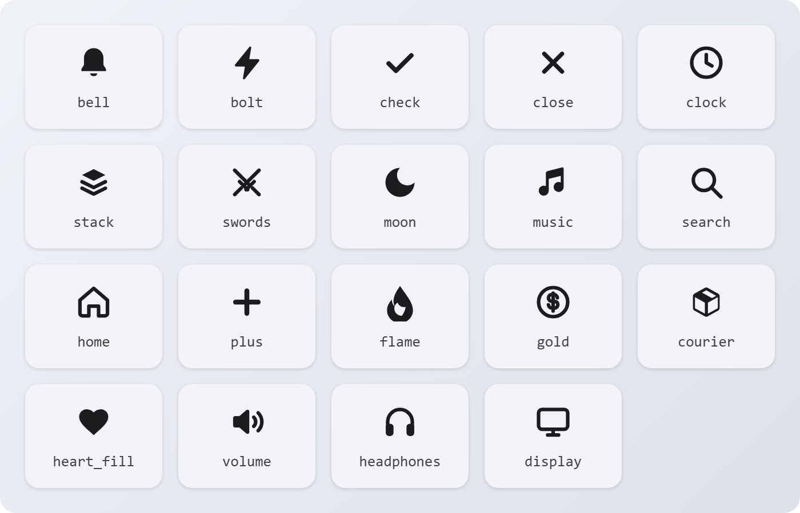

# Типы

## Иконки

`Icon:` **`string`**

Либо название глифа островка, либо путь к картинке.

**Глифы.** Эти лучше всего смотрятся как одноцветные иконки в уведомлениях и активностях:

<figure><picture><source srcset="../.gitbook/assets/glyphs-dark.png" media="(prefers-color-scheme: dark)"></picture></figure>

`DynamicIsland.Glyphs()` возвращает все глифы, включая цветные иконки рун и вышек.

**Картинки.** Относительный путь внутри папки игры или чита, например `panorama/images/items/blink_png.vtex_c`. До 160 символов, без `..` и без абсолютных путей. Все скрипты вместе могут использовать до 32 разных картинок за сессию. Если картинка не загрузилась, островок покажет колокольчик.

## Цвета

`Tint:` **`string`** | **`Color`**

* Название системного цвета:

<figure><picture><source srcset="../.gitbook/assets/tints-dark.png" media="(prefers-color-scheme: dark)"></picture></figure>

* Строка hex: `"FF9F0A"` или `"#FF9F0A"`.
* `Color(r, g, b)`.

Если цвет не задан, у каждого скрипта будет свой постоянный цвет по его названию. На светлом островке текст в твоём цвете чуть затемняется, чтобы оставаться читаемым.

## Уровни

`Level:` **`string`**

| Значение | Что происходит |
| --- | --- |
| `"passive"` | Без баннера и звука, сразу в центр уведомлений. |
| `"active"` | Обычный баннер. `(по умолчанию)` |
| `"time-sensitive"` | Обгоняет другие уведомления, играет звук и проходит через фокус, если пользователь разрешил срочные оповещения. |

## Звуки

`Sound:` **`string`**

Для `Notify`: `"default"`, `"chime"`, `"success"`, `"failure"`. Пользователь может выключить звуки оповещений вообще или только у твоего скрипта, так что уведомление может прийти без звука, даже если ты его попросил.

Для `PlaySound` всё то же плюс собственные звуки островка: `notification_toast`, `timer_chime`, `courier_delivered`, `courier_death_or_fail`, `button_press`, `button_dismiss`, `wheel_notch`, `wheel_boundary_bump`, `island_expand`, `island_collapse`, `island_hover`, `toast_dismiss`.

## Причины окончания

Передаются в `onEnd`, когда островок заканчивает твою активность.

| Причина | Когда |
| --- | --- |
| `"dismissed"` | Пользователь смахнул её. |
| `"denied"` | Пользователь выключил твой скрипт. |
| `"muted"` | Скрипт заглушён за то, что слал слишком много. |
| `"stale"` | Не было `Update` дольше, чем `staleAfter`. |
| `"expired"` | Она шла 4 часа. |

## Причины отказа

Второе значение, которое возвращают `Notify` и `Activity.Start`, если вызов не прошёл.

| Причина | Что значит |
| --- | --- |
| `"Notify expects a table"` | Передано не таблица. |
| `"Activity.Start expects a table"` | То же для активностей. |
| `"app required"` | Нет `app` или он пустой. |
| `"title required"` | У уведомления нет `title`. |
| `"bad arguments"` | При чтении таблицы что-то выбросило ошибку. |
| `"not allowed"` | Пользователь запретил твой скрипт. |
| `"muted"` | Скрипт заглушён до следующей перезагрузки. |
| `"rate limited"` | Слишком много уведомлений слишком быстро. |
| `"busy"` | Уже ждёт слишком много уведомлений или запросов разрешения. |
| `"too many apps"` | За сессию использовано больше 24 разных названий. |
| `"too many activities"` | Уже идут 3 активности. |
